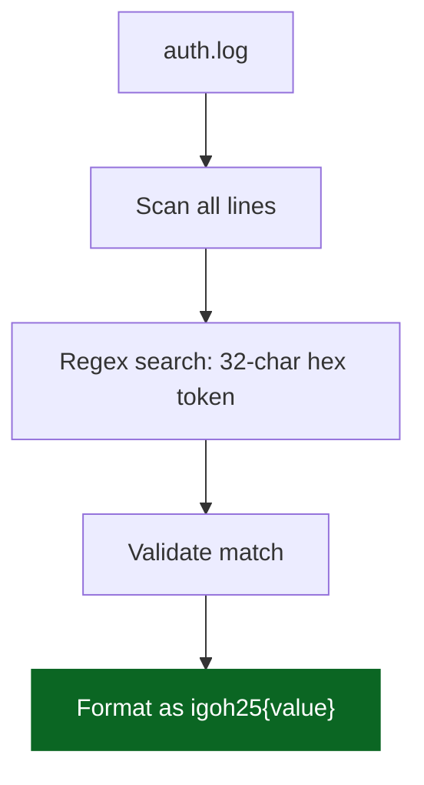

<div align="center">
<picture>
    <source media="(prefers-color-scheme: dark)" 
            srcset="https://img.shields.io/badge/Regex-Pattern%20Extraction-success?logo=regex&logoColor=white&labelColor=0d1117&color=8e44ad">
    
</picture>
<br>
<sub>Extracting a hidden MD5 hash from log files using regular expressions.</sub>

<table>
    <tr><td><strong>CTF</strong></td><td>iGoH 2025</td><td><strong>Category</strong></td><td>Misc</td></tr>
    <tr><td><strong>Difficulty</strong></td><td>Easy</td><td><strong>Points</strong></td><td>50</td></tr>
    <tr><td><strong>Exploit Time</strong></td><td>&lt; 3 min</td><td><strong>Flag</strong></td><td><code>igoh25{44c5b763d21e9a3ed8cad56977bfd75c}</code></td></tr>
</table>

<details><summary>Flow Diagram (Mermaid)</summary>


</details>
</div>

# 🔍 Challenge Overview

The challenge provided a file named **`auth.log`** containing mixed log entries.
Despite the final line saying **"End of log. No flags found."**, the challenge description hinted that this is a **regex‑based extraction problem**.

The goal was to detect patterns inside the logs — specifically a **hidden MD5‑like string** that fits the CTF flag format.

---

# 🔎 Analysis

Inside the log file, several entries looked like noise, fake tokens, or malformed values:

```
[2025-11-21 09:12:04] INFO: User login attempt: john_doe
[2025-11-21 09:12:05] WARN: Invalid password for user: alice
[2025-11-21 09:12:07] DEBUG: Session ID -> x97g3bn71n
[2025-11-21 09:12:08] INFO: token{345z8u4d_wd2#s3p@gx}
[2025-11-21 09:12:09] DEBUG: iGO25{h4bb4c9-XX4bQ} => *attempt#1 failed*
[2025-11-21 09:12:10] DEBUG: token -> 44c5b763d21e9a3ed8cad56977bfd75c
[2025-11-21 09:12:12] INFO: [MALFORMED] invalid format for token{xxxyyyzzz}.
[2025-11-21 09:12:14] INFO: temp_token{idc4982!oOsklv}
[2025-11-21 09:12:15] DEBUG: "Token -> !@idB$s3p#l"
[2025-11-21 09:12:17] INFO: End of log. No flags found.
```

The important line is:

```
DEBUG: token -> 44c5b763d21e9a3ed8cad56977bfd75c
```

This string is:

* **32 characters**
* **hexadecimal**
* matches typical **MD5 hash structure**

Exactly what the challenge description implies we should search for using regex.

---

# 🎯 Solution Approach

### **Step 1 — Identify a regex pattern**

We want to detect:

* the keyword `token`
* optional spaces
* an arrow `->`
* optional spaces
* **exactly 32 hex characters**

Pattern used:

```
token\s*->\s*([a-f0-9]{32})
```

### **Step 2 — Extract the pattern**

The match returned:

```
44c5b763d21e9a3ed8cad56977bfd75c
```

### **Step 3 — Wrap inside flag format**

```
igoh25{44c5b763d21e9a3ed8cad56977bfd75c}
```

---

# 💻 Python Script

```python
import re

# Read the auth.log file
with open('auth.log', 'r') as f:
    content = f.read()

# Regex pattern to extract the token value (32-char hex)
pattern = r'token\s*->\s*([a-f0-9]{32})'

# Find the match
match = re.search(pattern, content, re.IGNORECASE)

if match:
    hex_value = match.group(1)
    flag = f"igoh25{{{hex_value}}}"
    print(f"Flag: {flag}")
else:
    print("Flag not found!")
```

---

# 🖥️ Output

```
Flag: igoh25{44c5b763d21e9a3ed8cad56977bfd75c}
```

---

# 🎉 Final Flag

```
igoh25{44c5b763d21e9a3ed8cad56977bfd75c}
```

---

# 📚 Key Concepts Used

* **Regex Character Classes** — `[a-f0-9]` for hex characters
* **Quantifiers** — `{32}` enforces exact length
* **Optional Whitespace Matching** — `\s*`
* **Capture Groups** — extract only the hex token
* **Case‑insensitive search** with `re.IGNORECASE`

---

# 💡 Lessons Learned

1. Red herrings like *“No flags found”* are common in CTF logs
2. Hidden data often follows predictable formats (e.g., MD5)
3. Regex is powerful for scanning structured logs
4. Always inspect every line — the real flag may be disguised among noise

