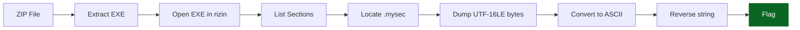

<div align="center">
<picture>
    <source media="(prefers-color-scheme: dark)" srcset="https://img.shields.io/badge/Reverse%20Engineering-Windows%20Binary-success?logo=windows11&logoColor=white&labelColor=0d1117&color=1565c0">
    
</picture>

<sub>Hidden UTF‑16LE payload stored in a custom PE section reveals a reversed flag string.</sub>

<table>
    <tr><td><strong>CTF</strong></td><td>IGOH CTF 2025</td><td><strong>Category</strong></td><td>Reverse Engineering</td></tr>
    <tr><td><strong>Difficulty</strong></td><td>Easy</td><td><strong>Binary Sections</strong></td><td>1 custom (.mysec)</td></tr>
    <tr><td><strong>Exploit Time</strong></td><td>&lt; 3 min</td><td><strong>Flag</strong></td><td><code>igoh25{b6466b87ba713e8fbc336af3bb53c9}</code></td></tr>
</table>

<details>
<summary>Flow Diagram (Mermaid)</summary>



</details>
</div>

# ClassicInvestigator — Writeup

## 1. Extracting the EXE

The challenge zip was password‑protected:

```bash
unzip -P igoh25 ClassicInvestigator_1.zip -d classic
```

This extracted:

```
classic/ClassicInvestigator.exe
```

Running it (e.g., Wine) failed due to missing dependencies → proceed with static analysis.

---

## 2. Inspecting the Binary

Load the executable in **rizin**:

```bash
rizin -AA classic/ClassicInvestigator.exe
```

Search for strings:

```rizin
iz~igoh
```

→ **No results**.

Then inspect binary sections:

```rizin
iS
```

Found a suspicious custom section:

```
.mysec   0x140023000    <-- interesting
```

Non‑standard sections often hide data or flags.

---

## 3. Dumping the Hidden Section

Dump bytes:

```rizin
px 0x400 @ 0x140023000
```

The dump showed **UTF‑16LE encoded characters**, e.g.:

```
7d00 3900 6300 3300 3500 62 00 ...
```

UTF‑16LE layout:

```
[ASCII byte] 00
```

Extracting the **ASCII bytes only** yields:

```
}9c35bb3fa633cbf8e317ab78b6646b{52hogi
```

This resembles a **reversed flag**.

---

## 4. Reversing the Encoded Data

Reverse the string:

```
igoh25{b6466b87ba713e8fbc336af3bb53c9}
```

Matches the expected format.

---

## ✔ Final Flag

```
igoh25{b6466b87ba713e8fbc336af3bb53c9}
```

