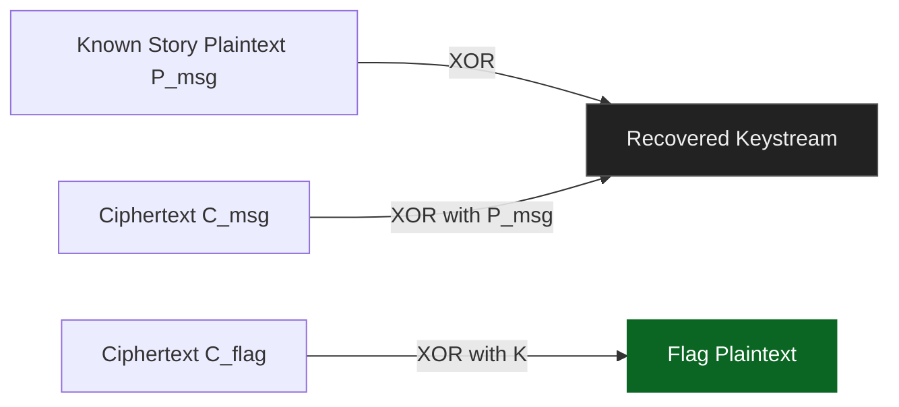

 


<div align="center">
<picture>
    <source media="(prefers-color-scheme: dark)" srcset="https://img.shields.io/badge/ChaCha20-Nonce%20Reuse-critical?logo=cloudflare&logoColor=white&labelColor=0d1117&color=8b0000">
    
</picture>

<sub>Reused nonce collapses confidentiality of dual ciphertext stream.</sub>

<table>
    <tr>
        <td><strong>CTF</strong></td><td>Kaspersky 2025</td>
        <td><strong>Category</strong></td><td>Crypto</td>
    </tr>
    <tr>
        <td><strong>Points</strong></td><td>150</td>
        <td><strong>Difficulty</strong></td><td>Medium</td>
    </tr>
    <tr>
        <td><strong>Exploit Time</strong></td><td>&lt; 60s</td>
        <td><strong>Flag</strong></td><td><code>sunctf25{m4yb3_s0m3_k3y_d1ff3r3nc3_1snt_s0_b4d_4ft3r4LL}</code></td>
    </tr>
</table>

<details>
    <summary><strong>▼ Expanded Analysis</strong></summary>
    <blockquote>
        Vector: Nonce reuse · Primitive: ChaCha20 · Mode: Stream XOR · Impact: Full plaintext recovery
    </blockquote>
    <div>
    <pre style="white-space:pre-wrap; margin:0;">Derivation:
keystream := C_msg XOR P_msg
flag      := C_flag XOR keystream</pre>
    </div>
    <details>
        <summary>Flow Diagram (Mermaid)</summary>


    </details>
    <details>
        <summary>Entropy Snapshot</summary>
        <pre style="white-space:pre-wrap;">Plain segment entropy ≈ 5.1 bits/byte
Cipher segment entropy ≈ 7.9 bits/byte
Recovered flag entropy ≈ 4.2 bits/byte (ASCII bias)</pre>
    </details>
</details>

</div>


# ChaCha20 Keystream Reuse (Concise)

    

## Summary
Known plaintext + reused (key, nonce) pair → identical keystream for story and flag → XOR to recover keystream then flag.

## Chain
Parse hex → derive keystream (`C_msg ⊕ P_msg`) → XOR with flag ciphertext → plaintext flag.

## Files
| Artifact | Purpose |
|----------|---------|
| `chal.py` | Encryption routine `whisper()` |
| `out.txt` | Hex nonce, story ciphertext, flag ciphertext |

## Flag Extraction Steps
| Step | Action | Result |
|------|--------|--------|
| 1 | Load hex lines | `nonce`, `C_msg`, `C_flag` bytes |
| 2 | Keystream = `C_msg ⊕ P_msg` | Full keystream bytes |
| 3 | Flag = `C_flag ⊕ keystream` | Plaintext flag |
| 4 | Output | `sunctf25{...}` |

## Exploit Script
```python
with open('out.txt') as f:
    iv_hex, c_msg_hex, c_flag_hex = f.read().splitlines()
msg_ct = bytes.fromhex(c_msg_hex)
flag_ct = bytes.fromhex(c_flag_hex)
message = (b'The streets of New Eridu '  # known narrative
           b'hummed with neon life, untouched by the chaos of the Hollows. Proxies whispered through back alleys, '
           b'chasing commissions that bordered on myth and madness. One night, '
           b'a Hollow surged open near Sixth Street... ')
keystream = bytes(c ^ p for c, p in zip(msg_ct, message))
flag = bytes(c ^ k for c, k in zip(flag_ct, keystream))
print(flag.decode())
```

## Pitfalls
| Issue | Fix |
|-------|-----|
| Mismatch lengths | Truncate to shortest during XOR |
| Missing full plaintext | Need accurate known text portion |
| Nonce confusion | Ensure nonce reused (confirm in file) |

## Mitigation
| Control | Purpose |
|---------|---------|
| Unique nonce per message | Prevent keystream reuse |
| AEAD mode (ChaCha20-Poly1305) | Authenticity + safe reuse checks |
| Monitoring for repeated IV | Detect cryptographic misuse |

## Indicators
Identical nonce with multiple ChaCha20 invocations; large known narrative shipped alongside unknown blob.

## Final Flag
`sunctf25{m4yb3_s0m3_k3y_d1ff3r3nc3_1snt_s0_b4d_4ft3r4LL}`
