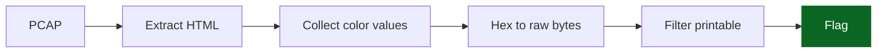

 


<div align="center">
<picture>
    <source media="(prefers-color-scheme: dark)" srcset="https://img.shields.io/badge/CSS-Color%20Stego-success?logo=css3&logoColor=white&labelColor=0d1117&color=1e88e5">
    
</picture>
<sub>Sequential color triplets encode printable ASCII for flag recovery.</sub>

<table>
    <tr><td><strong>CTF</strong></td><td>Kaspersky 2025</td><td><strong>Category</strong></td><td>Misc / Forensics</td></tr>
    <tr><td><strong>Difficulty</strong></td><td>Easy</td><td><strong>Triplets</strong></td><td>25</td></tr>
    <tr><td><strong>Exploit Time</strong></td><td>&lt; 2 min</td><td><strong>Flag</strong></td><td><code>sunctf25{u6ly_c55_c0l0r5}</code></td></tr>
</table>

<details>
    <summary><strong>▼ Expanded Analysis</strong></summary>
    <blockquote>Vector: Embedded style attributes · Primitive: Hex color triplets · Impact: Direct flag reconstruction</blockquote>
    <details>
        <summary>Flow Diagram (Mermaid)</summary>


    </details>
    <details>
        <summary>Noise Considerations</summary>
        <pre style="white-space:pre-wrap;">Non-printable bytes discarded; ordering preserved to avoid permutation corruption.</pre>
    </details>
</details>
</div>

# CSS Color Steganography (Concise)

    

## Summary
HTML in PCAP embeds sequential `color:#RRGGBB` values; interpreting each triplet’s raw bytes and filtering printable ASCII yields the flag.

## Chain
Load PCAP → extract HTML → parse CSS colors → hex→bytes → filter printable → flag.

## Recon
| Item | Observation |
|------|-------------|
| Flow | Single TCP stream to :5000 |
| Artifacts | `/dummy.js`, `/image.jpg`, `/` |
| Signal | 25 `.paragraphN` styles with unique colors |

## Extraction Steps
| Step | Action | Tool |
|------|--------|------|
| 1 | Dump traffic | `tshark -r traffic_latest.pcapng` |
| 2 | Isolate HTML | Wireshark export / tshark fields |
| 3 | Collect hex triplets | Grep `color:` |
| 4 | Convert to bytes | Python script |
| 5 | Keep printable | `32 <= b <= 126` filter |
| 6 | Output flag | Print string |

## Script
```python
colors = ["73aaee","75aaee","6eaaee","63aaee","74bb12",
          "66bb12","32bb12","35bb12","7bbb12","75ddaa",
          "36ddaa","6cddaa","79ddaa","5fddaa","63ddff",
          "35ddff","35ddff","5fddff","63ddff","30ddff",
          "6cddff","30ddff","72ddff","35ddff","7dddff"]
raw = b''.join(bytes.fromhex(x) for x in colors)
flag = ''.join(chr(b) for b in raw if 32 <= b <= 126)
print(flag)
```

## Pitfalls
| Issue | Fix |
|-------|-----|
| Extra non-printables | ASCII filter |
| Wrong order | Preserve original appearance order |
| Mixed casing | Normalize hex before parsing |

## Mitigation (Real World)
| Control | Purpose |
|---------|---------|
| Content sanitization | Strip unused style metadata |
| Traffic inspection | Detect large color sequences |
| Stego pattern rules | Alert on dense unique hex colors |

## Indicators
Unnaturally many CSS color declarations; sequential gradient-like triplets; flag-like ASCII after filtering.

## Final Flag
`sunctf25{u6ly_c55_c0l0r5}`
