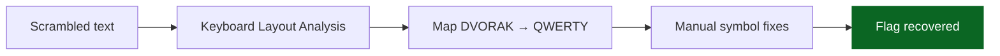

<!-- meta -->
---
title: Keyboard Layout Typo
ctf: iGoH 2025
category: Misc
points: 50
difficulty: Easy
date: 2025-11-23
flag: igoh25{05cf677b6b067cad39d5c86eb39a6a0b}
---
<!-- /meta -->

<div align="center">
<picture>
    <source media="(prefers-color-scheme: dark)" srcset="https://img.shields.io/badge/Keyboard-Layout%20Typo-success?logo=keyboard&logoColor=white&labelColor=0d1117&color=1e88e5">
    
</picture>
<sub>Text typed in DVORAK layout but read as QWERTY reveals the flag.</sub>

<table>
    <tr><td><strong>CTF</strong></td><td>iGoH 2025</td><td><strong>Category</strong></td><td>Misc</td></tr>
    <tr><td><strong>Difficulty</strong></td><td>Easy</td><td><strong>Characters</strong></td><td>~32</td></tr>
    <tr><td><strong>Exploit Time</strong></td><td>&lt; 5 min</td><td><strong>Flag</strong></td><td><code>igoh25{05cf677b6b067cad39d5c86eb39a6a0b}</code></td></tr>
</table>

<details><summary>Flow Diagram (Mermaid)</summary>


</details>
</div>

## Summary
The challenge text is typed using the **DVORAK layout** but interpreted as **QWERTY**, producing unreadable characters. Reversing the layout swap and correcting two symbol mappings reveals the final flag.

## Chain
Scrambled input → Detect layout mismatch → DVORAK→QWERTY map → Symbol adjustments → Flag extracted.

## Recon
| Item | Observation |
|------|-------------|
| Input | `cird25?05ju677x6x067jae39e5j86.x39a6a0x+` |
| Hint | Challenge title: *Keyboard Layout* |
| Suspected root cause | DVORAK vs QWERTY mismatch |
| Pattern | Letters roughly similar position to DVORAK home‑row |

## Extraction Steps
| Step | Action | Tool / Method |
|------|--------|---------------|
| 1 | Inspect scrambled text | Manual |
| 2 | Identify incorrect keyboard layout | DVORAK ↔ QWERTY comparison |
| 3 | Build DVORAK→QWERTY map | Python dictionary |
| 4 | Correct unmapped symbols | `? → {` and `+ → }` |
| 5 | Run script to decode | Python |

## Python Script
```python
mapping = {
    "'": "q", ",": "w", ".": "e", "p": "r", "y": "t",
    "f": "y", "g": "u", "c": "i", "r": "o", "l": "p",
    "/": "[", "=": "]",
    "a": "a", "o": "s", "e": "d", "u": "f", "i": "g",
    "d": "h", "h": "j", "t": "k", "n": "l", "s": ";",
    "-": "'",
    ";": "z", "q": "x", "j": "c", "k": "v", "x": "b",
    "b": "n", "m": "m", "w": ",", "v": ".", "z": "/",
    "1": "1", "2": "2", "3": "3", "4": "4",
    "5": "5", "6": "6", "7": "7", "8": "8",
    "9": "9", "0": "0",
    "?": "{", "+": "}"
}

def dvorak_to_qwerty(text):
    return ''.join(mapping.get(c, c) for c in text)

scrambled = "cird25?05ju677x6x067jae39e5j86.x39a6a0x+"
print(dvorak_to_qwerty(scrambled))
```

## Final Flag
```
igoh25{05cf677b6b067cad39d5c86eb39a6a0b}
```
