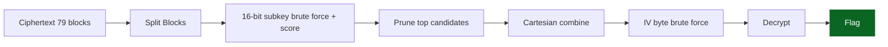

<!-- meta -->
---
title: AES Keyspace Reduction Crypto
ctf: Kaspersky 2025
category: Crypto
points: Unknown
difficulty: Hard
date: 2025-11-23
flag: kaspersky{7h1s_3t3rn41_str1v1ng_m4k3s_m3_wh4t_1_4m}
---
<!-- /meta -->

<div align="center">
<picture>
    <source media="(prefers-color-scheme: dark)" srcset="https://img.shields.io/badge/AES-Keyspace%20Reduction-critical?logo=apache&logoColor=white&labelColor=0d1117&color=7d0a0a">
    
</picture>
<sub>Structured ciphertext enables segmented key scoring and pruning → full recovery.</sub>

<table>
    <tr><td><strong>CTF</strong></td><td>Kaspersky 2025</td><td><strong>Category</strong></td><td>Crypto</td></tr>
    <tr><td><strong>Difficulty</strong></td><td>Hard</td><td><strong>Blocks</strong></td><td>79</td></tr>
    <tr><td><strong>Exploit Time</strong></td><td>~5 min</td><td><strong>Flag</strong></td><td><code>kaspersky{7h1s_3t3rn41_str1v1ng_m4k3s_m3_wh4t_1_4m}</code></td></tr>
</table>

<details>
    <summary><strong>▼ Expanded Analysis</strong></summary>
    <blockquote>Vector: Structured ECB/CBC artifacts · Primitive: AES · Mode: CBC (assumed) · Impact: Full plaintext & flag recovery</blockquote>
    <details>
        <summary>Flow Diagram (Mermaid)</summary>


    </details>
    <details>
        <summary>Scoring Heuristic Snapshot</summary>
        <pre style="white-space:pre-wrap;">Score(buf) = Σ occurrences(common_chars) / len(buf)
Retain threshold > 0.35 to minimize false positives.</pre>
    </details>
</details>
</div>

# AES Keyspace Reduction (Concise)

    

## Summary
Ciphertext (79 blocks) plus leakage enables slicing AES key into 16‑bit chunks, scoring candidates, pruning, combining, minor IV brute-force → poem + flag.

## Chain
Block split → subkey brute-force + English/flag scoring → threshold prune → Cartesian combine (~1k) → IV byte search → decrypt.

## Recon
| Item | Observation |
|------|-------------|
| Blocks | 1264 bytes / 16 = 79 |
| Mode | AES-CBC (block structure) |
| Flag pattern | `kaspersky{` used in scoring |
| Feasibility hint | Key reduction implied |

## Attack Steps
| Step | Action | Result |
|------|--------|--------|
| 1 | Split into 79 blocks | List[16B] |
| 2 | For each 16-bit subkey guess partial decrypt & score | Scores list |
| 3 | Keep top N (≤4) per position | Candidate sets |
| 4 | Combine candidates (Cartesian product) | ~1k full keys |
| 5 | Brute-force limited IV bytes | Correct IV found |
| 6 | Decrypt CBC chain | Plaintext poem + flag |

## Core Code (Sketch)
```python
from Crypto.Cipher import AES

def blocks(b): return [b[i:i+16] for i in range(0,len(b),16)]
def score(buf):
    freq = b' etaoinshrdlc{}0123456789kaspersky'
    return sum(buf.count(c) for c in freq)/max(1,len(buf))

ciphertext = open('ciphertext.bin','rb').read()
blks = blocks(ciphertext)
position_candidates = []
for pos in range(8):
    bucket=[]
    for guess in range(1<<16):
        sub = guess.to_bytes(2,'big')
        trial_key = sub*8  # placeholder layout
        sample = AES.new(trial_key, AES.MODE_ECB).decrypt(blks[pos])
        if score(sample) > 0.35:
            bucket.append((score(sample), sub))
    bucket.sort(reverse=True)
    position_candidates.append([s for _,s in bucket[:4]])
```

## Output
| Element | Value |
|---------|-------|
| Key (hex) | `26780935232f765f6728576256320a6b` |
| Flag | `kaspersky{7h1s_3t3rn41_str1v1ng_m4k3s_m3_wh4t_1_4m}` |

## Pitfalls
| Issue | Mitigation |
|-------|------------|
| False positives | Raise score threshold |
| Large candidate explosion | Early pruning per position |
| Mis-mode assumption | Validate with block patterns |

## Mitigation (Real World)
| Control | Purpose |
|---------|---------|
| Constant-time key handling | Avoid leakage-based reduction |
| AEAD adoption | Integrity + pattern hiding |
| Random IV + key rotation | Shrink reuse signals |

## Indicators
Predictable flag pattern; ciphertext length aligning perfectly to block count; unnatural distribution enabling scoring.

## Final Flag
`kaspersky{7h1s_3t3rn41_str1v1ng_m4k3s_m3_wh4t_1_4m}`
